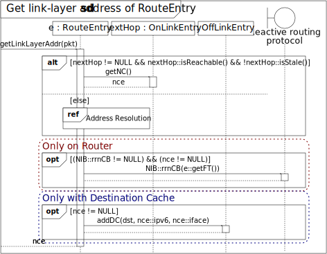
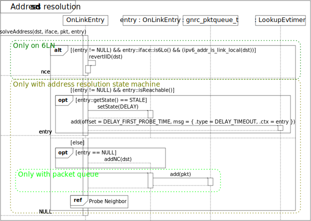
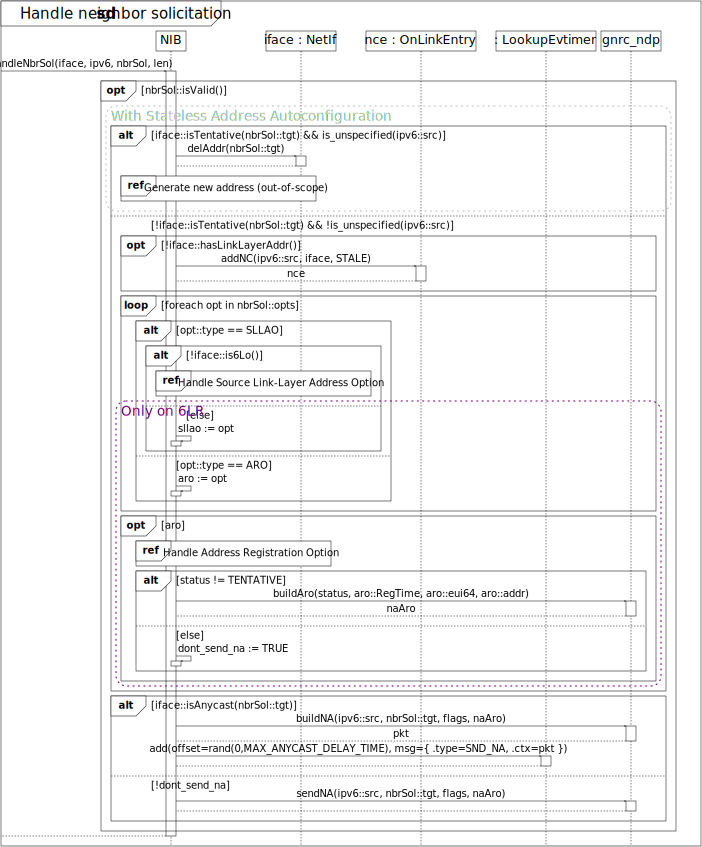
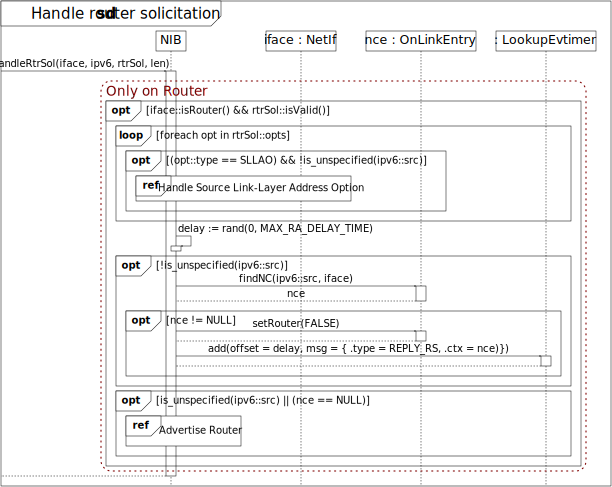
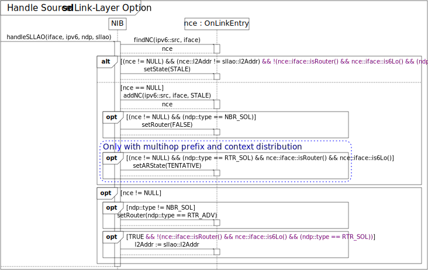
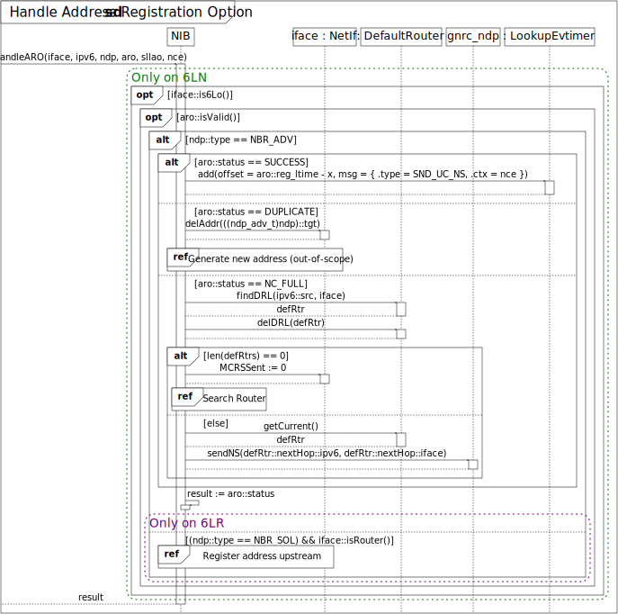
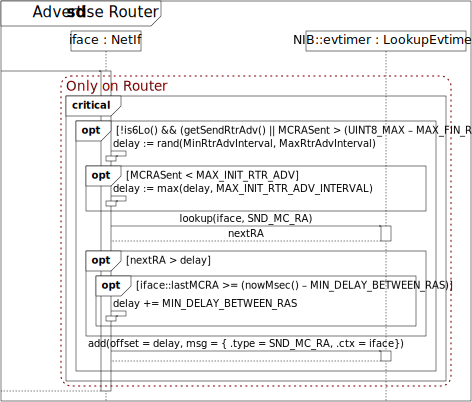
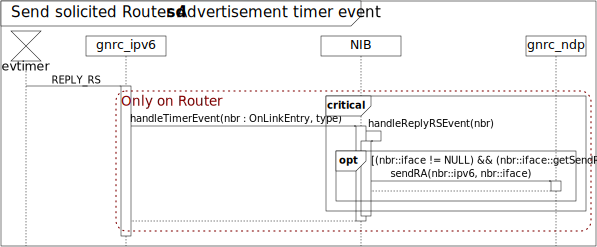

# STILL WIP

# Architecture
## Node classes
How the NIB is constructed is greatly dependent on what role the node takes in a network. Analysis of the corresponding RFCs resulted in the following made-up of node classes:

Depending on the node class certain features are compiled into the RIOT image of the node. This is marked with the corresponding color of the node class:

- Features of all IPv6 hosts are marked black
- features for IPv6 routers are marked maroon,
- features for all 6LoWPAN nodes (6LN) are marked green,
- features for 6LoWPAN routers (6LR) are marked purple, and
- features for 6LoWPAN border routers (6LBR) are marked teal.

Note, that any node can have any of these classes at any point. This is why additional dynamic checks on an interface if it really is e.g. a 6LoWPAN interface are needed.

Additional to their role in the network there are certain features that are beyond orthogonal to these roles:

- Components and behaviors required for the NDP address resolution state-machine (typically provided on non-6LoWPAN hosts and all routers) are marked olive,
- Nodes that start advertising themselves as routers on start-up are marked orange, and

The reasoning for not including the NDP address resolution state-machine on non-routing 6LN is that on these kinds of nodes [non-link-local addresses are always considered off-link and the link-layer addresses of link-local addresses are derived from their IID][6lowpan-host-behavior]. So none of this information needs to be stored.

Furthermore, there are features the user can decide to de-/activate:

- Asynchronous error reporting is marked red
- Queueing of packets for address resolution is marked lime
- Usage of a destination cache is marked navy
- Stateless Address Autoconfiguration according to [RFC4862] is marked silver
- Handling of redirect messages (which requires a destination cache) is marked azure

Lastly, there are the components related to [6LoWPAN's two substitutable features][6lowpan-subst-feat]:

- Components related to multihop prefix and context distribution are marked blue, and
- Components related to multihop Duplicate Address Detetection are marked magenta

[6lowpan-host-behavior]: https://tools.ietf.org/html/rfc6775#section-5.6
[6lowpan-subst-feat]: https://tools.ietf.org/html/rfc6775#section-8
[RFC4862]: https://tools.ietf.org/html/rfc4862

## API

* NIB_FT::iter(nextHop) allows for generation of source route trees (default: NULL, for all entries)

## Implementation

OnLinkEntry::addNC() treats the **OnLinkEntry** collection as a cache:

# Use-cases
## Initialize interface

## Determine next hop link-layer address

(Search in **OffLinkEntry**s also on non-routers for prefix list)

### Get link-layer address of route entry

### Address resolution

## Probe neighbor

## Become a router advertising interface

## Cease to be a router advertising interface

TODO

## Upper-layer reachability confirmation
TODO

## Receive packet event

### Handle Neighbor Solicitation

(nbr_sol_t::isValid(), see [RFC4861])
(flags see [RFC4861])

### Handle Neighbor Advertisement

(nbr_adv_t::isValid(), see [RFC4861])

### Handle Router Solicitation

(rtr_sol_t::isValid(), see [RFC4861])

### Handle Router Advertisement

(rtr_adv_t::isValid(), see [RFC4861])

### Handle Redirect
TODO

### Handle advertised link-layer

### Handle Duplicate Address Request
TODO

### Handle Duplicate Address Confirmation
TODO

### Handle Source Link-Layer Address Option

### Handle Prefix Information Option
TODO

### Handle Redirect Header Option
(TLLAO => if NCE created: set STALE)
TODO

### Handle MTU Option
TODO

### Handle Address Registration Option

(nbr_sol_t::isValid(), see [RFC6775])
(x == 'before the Lifetime expires')

### Register address upstream

### Handle 6LoWPAN Context Option
TODO

### Handle Authoritative Border Router Option
TODO

## Search router

## Advertise router

## Retransmit Neighbor Solicitation timer event

(State should be none of the above [UNMANAGED == 0] when OnLinkEntry not in NIB because of previous deletion)
(Two different types to differentiate in timer, otherwise the same)
(PROBE behavior according to [RFC7048])

[RFC7048]: https://tools.ietf.org/html/rfc7048

## Delayed Neighbor Advertisement timer event

## Search router timer event

## Reconfirm router timer event

## Reachability timeout timer event

## Delay timeout timer event

## Address registration timeout timer event

## 6LoWPAN Context timeout timer event
TODO

## Authoritive Border Router timeout timer event
TODO

## Prefix timeout timer event
TODO

## Route timeout timer event
TODO

## Router timeout timer event
TODO

## Send unsolicited Router Advertisement timer event

sendRA() sets iface::lastMCRA to current time in milliseconds

## Send solicited Router Advertisement timer event

## Recalculate Reachable Time
TODO (see https://tools.ietf.org/html/rfc4861#section-6.3.4)

## Wake-up from sleep
TODO

## Add address to interface
TODO

## Remove address from interface
TODO

## Set neighbor cache entry externally
TODO

## Delete neighbor cache entry externally
TODO

## Set prefix externally
TODO

## Delete prefix externally
TODO

## Add forwarding table entry
TODO

## Delete forwarding table entry
TODO

## Set reactive routing callback
TODO

## Set 6LoWPAN compression context
TODO

## Remove 6LoWPAN compression context
TODO

[RFC4861]: https://tools.ietf.org/html/rfc4861
[RFC6775]: https://tools.ietf.org/html/rfc6775
