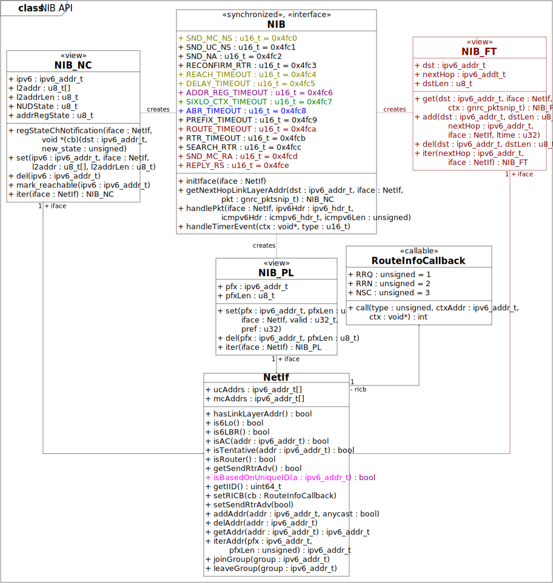
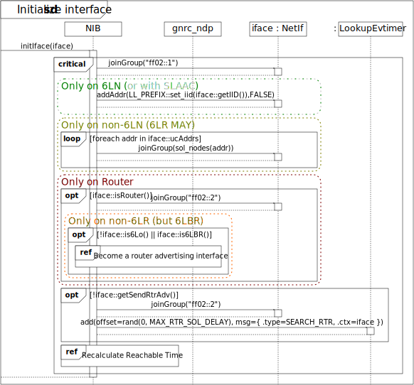
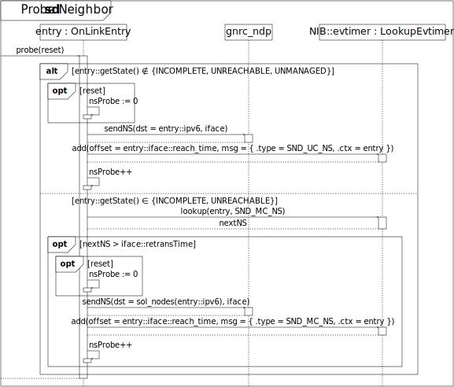
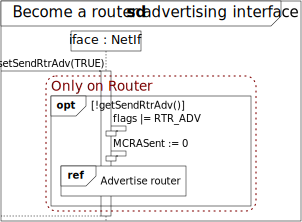

# STILL WIP

# Architecture
## Node classes
How the NIB is constructed is greatly dependent on what role the node takes in a network. Analysis of the corresponding RFCs resulted in the following made-up of node classes:

Depending on the node class certain features are compiled into the RIOT image of the node. This is marked with the corresponding color of the node class:

- Features of all IPv6 hosts are marked black
- features for IPv6 routers are marked maroon,
- features for all 6LoWPAN nodes (6LN) are marked green,
- features for 6LoWPAN routers (6LR) are marked purple, and
- features for 6LoWPAN border routers (6LBR) are marked teal.

Additional to their role in the network there are certain features that are beyond orthogonal to these roles:

- Components and behaviors required for the NDP address resolution state-machine (typically provided on non-6LoWPAN hosts and all routers) are marked olive,
- Nodes that start advertising themselves as routers on start-up are marked orange, and
- Nodes that do not advertising themselves as routers on start-up are marked gold.

The reasoning for not including the NDP address resolution state-machine on non-routing 6LN is that on these kinds of nodes [non-link-local addresses are always considered off-link and the link-layer addresses of link-local addresses are derived from their IID][6lowpan-host-behavior]. So none of this information needs to be stored.

Furthermore, there are features the user can decide to de-/activate:

- Asynchronous error reporting is marked red
- Queueing of packets for address resolution is marked lime
- Usage of a destination cache is marked navy
- Stateless Address Autoconfiguration according to [RFC4862] is marked silver
- Handling of redirect messages (which requires a destination cache) is marked azure

Lastly, there are the components related to [6LoWPAN's two substitutable features][6lowpan-subst-feat]:

- Components related to multihop prefix and context distribution are marked blue, and
- Components related to multihop Duplicate Address Detetection are marked magenta

[6lowpan-host-behavior]: https://tools.ietf.org/html/rfc6775#section-5.6
[6lowpan-subst-feat]: https://tools.ietf.org/html/rfc6775#section-8
[RFC4862]: https://tools.ietf.org/html/rfc4862

## API

## Implementation

(**OffLinkEntry** also on non-routers for prefix list.)

# Use-cases
## Initialize interface

## Determine next hop link-layer address

(Search in **OffLinkEntry**s also on non-routers for prefix list)

### Get link-layer address of route entry

### Address resolution

## Probe neighbor

## Become a router advertising interface
TODO

## Cease to be a router advertising interface
TODO

## Upper-layer reachability confirmation
TODO

## Receive packet event

### Handle Neighbor Solicitation
TODO

### Handle Neighbor Advertisement
TODO

### Handle Router Solicitation
TODO

### Handle Router Advertisement
TODO

### Handle Redirect
TODO

### Handle Duplicate Address Request
TODO

### Handle Duplicate Address Confirmation
TODO

## Retransmit Neighbor Solicitation timer event
TODO

## Delayed Neighbor Advertisement timer event
(Advertisement of anycast address)
TODO

## Reconfirm router timer event
TODO

## Reachability timeout timer event
TODO

## Delay timeout timer event
TODO

## Address registration timeout timer event
TODO

## 6LoWPAN Context timeout timer event

## Authoritive Border Router timeout timer event
TODO

## Prefix timeout timer event
TODO

## Route timeout timer event
TODO

## Router timer event
TODO

## Search router timer event
TODO

## Send initial unsolicited Router Advertisement timer event
TODO

## Send unsolicited Router Advertisement timer event
TODO

## Send final unsolicited Router Advertisement timer event
TODO

## Set neighbor cache entry externally
TODO

## Delete neighbor cache entry externally
TODO

## Set prefix externally
TODO

## Delete prefix externally
TODO

## Add forwarding table entry
TODO

## Delete forwarding table entry
TODO

## Set reactive routing callback
TODO
